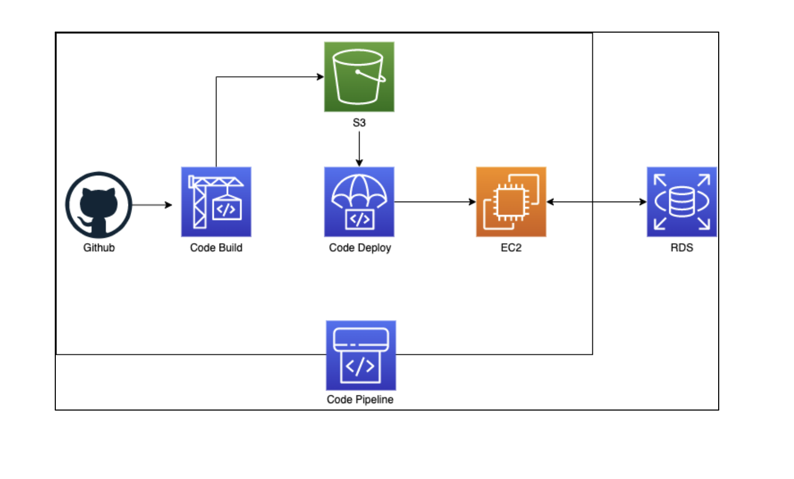
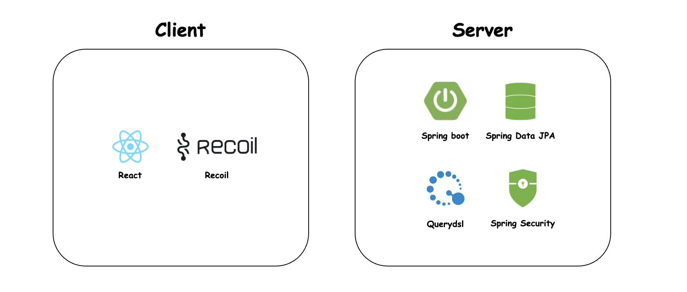

# SNS-Integration-Map (SNS 통합 지도)

### 배포 URL
URL : [SNS-Integration-Map](https://sns-integration-map.cf)

## 🌈 여러 SNS 정보를 한 눈에 볼 수 있습니다. 

여러번 웹사이트를 검색하는 일은 이제 그만!

네이버, 카카오 맵의 평점, 인스타그램의 해시태그 등의 정보를 검색 한 번에 볼 수 있어요.

SNS별 필터링 및 현재위치 기준으로 검색할 수도 있어요.

## CI/CD

## 기술 스택

## 대표 기능 예시

### 1. 지도 검색

- 왼쪽 사이드바의 구, 동, 카테고리를 입력하고 검색을 누른다. (SNS별 필터링도 가능)

### 2. SNS 로그인

- 카카오톡, 네이버 로그인 시 다음과 같이 프로필과 이름이 나옴.

### 3. GPS 기능과 현재 위치 기준 범위 검색

- 오른쪽 하단 GPS 버튼을 이용한 현재 위치 검색(빨간 큰 점)
- 현재 좌표 기준 200m 위치 검색 예시 (지도 왼쪽 상단)